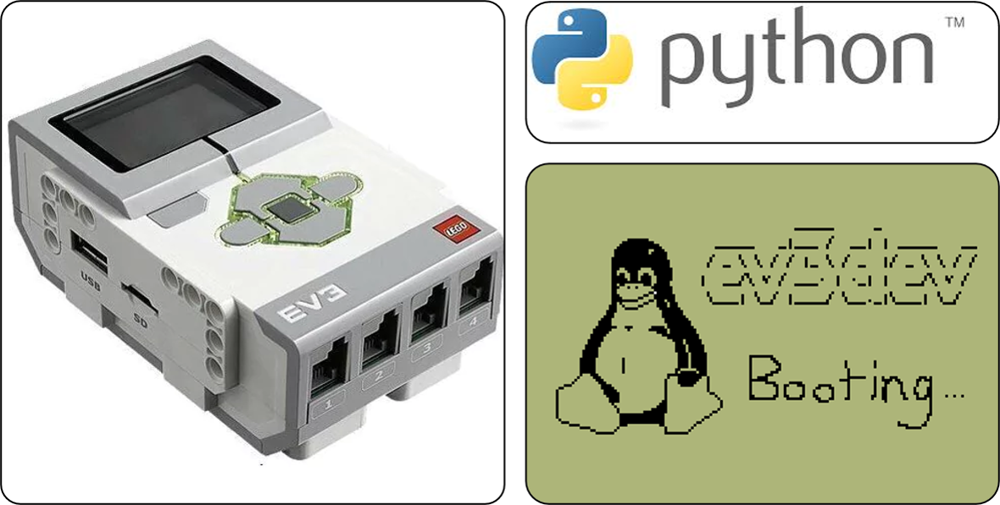
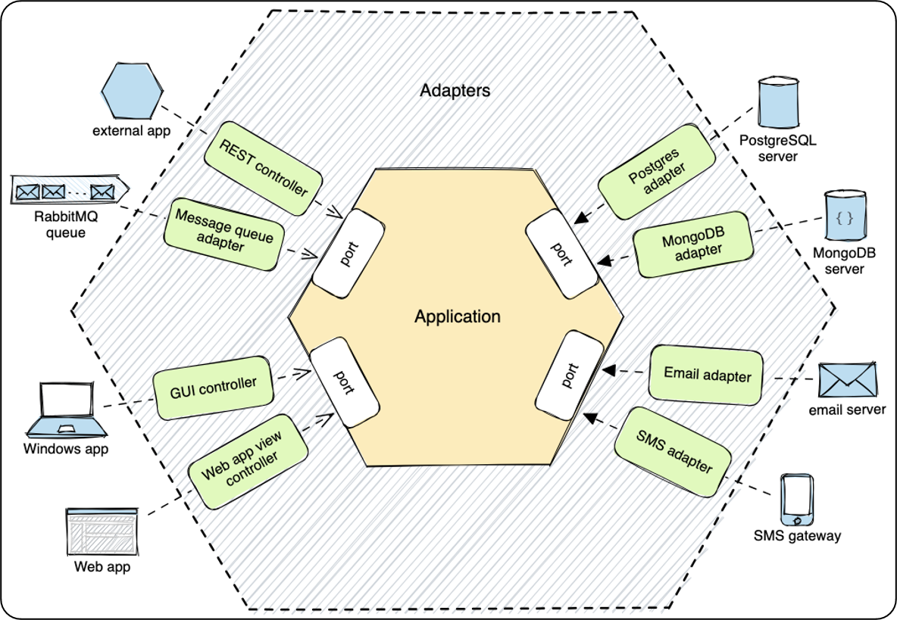

# Rover-DR

Educational and experimental mobile robotics platform based on LEGO MINDSTORMS EV3, ev3dev and Python.



## Objective

Rover-DR provides a modular foundation for the progressive development of monitoring, control, navigation and autonomous robotics capabilities on the LEGO EV3 platform.

This release consolidates deployment configuration for EV3 and simulation environments. A single `ROVER_HARDWARE_ENABLED` switch now controls physical integrations, startup includes operator selection of command/operation mode on the EV3, and deployment/security requirements are documented for reproducible execution.

## Platform

- LEGO MINDSTORMS EV3
- ev3dev
- Python 3
- python-ev3dev2

## Current capabilities

- Hexagonal Architecture with explicit application, port, adapter, infrastructure and bootstrap boundaries
- Dedicated `LOCAL + MANUAL` runtime for low-latency joystick control
- Direct synchronous motor control isolated from monitoring command queues
- Four-wheel Mecanum motor mapping with independent per-wheel calibration factors
- Linux joystick integration through `evdev`
- Fail-safe stop and neutral-safety barrier after joystick disconnection
- EV3 graphical mode selection and operational status feedback
- Periodic sensor, motor and controller monitoring for the standard runtime
- Thread-safe state repositories and read-only query adapters
- HTTP/JSON REST API on TCP port `8080`
- Consolidated Rover state through `GET /api/rover/state`
- Explicit motor query, command, guarded-operation and gateway ports
- Declarative REST route table with explicit gateway dispatch
- Shared EV3 motor-driver repository used by monitored and manual-control paths
- Motor state collection extracted from the monitor orchestration
- Centralized concrete composition in `bootstrap/rover_assembly.py`
- Architecture and Python 3.5 compatibility quality gates
- Graceful fallback when EV3 hardware integrations are disabled or unavailable

## Project structure

```text
xpe-rover-dr/
├── adapters/                 # inbound/outbound adapters
│   └── rest/                 # HTTP routing and declarative API route table
├── app/
│   ├── commands/             # focused command handlers
│   ├── services/             # application use cases
│   ├── command_service.py
│   ├── rover_application.py
│   └── rover_config.py
├── bootstrap/
│   └── rover_assembly.py     # concrete composition root
├── infrastructure/
│   ├── ev3/                  # EV3 gateways, drivers and UI helpers
│   ├── logging/              # application logging implementation
│   ├── monitoring/           # runtime monitors
│   ├── motor/                # driver repository and state collection
│   └── state/                # thread-safe state stores
├── ports/                    # focused input/output contracts
├── assets/
├── config/
├── docs/
├── scripts/
├── tests/
└── main.py                   # process entry point
```

The former top-level `services/` package no longer exists. Application services live
under `app/services/`, while monitoring, state, logging and EV3-specific concerns live
under `infrastructure/`.

## Architecture

The S02.10 structure reinforces the dependency direction of the hexagonal design:

1. `app/` contains use cases and orchestration and does not import concrete adapters or infrastructure;
2. `ports/` contains focused contracts and does not depend on application or concrete layers;
3. `adapters/` translate external protocols and application-facing queries;
4. `infrastructure/` implements EV3 hardware, monitoring, logging and state persistence details;
5. `bootstrap/rover_assembly.py` is the single concrete composition point introduced in this increment;
6. `main.py` delegates composition to bootstrap and remains focused on process signals and execution;
7. the `LOCAL + MANUAL` graph retains synchronous motor writes and read-only REST queries, without monitoring queues in its control path;
8. the standard runtime preserves the monitored command path;
9. the broad motor contract is retained only as a compatibility aggregate over focused query, command, guarded-operation and gateway contracts;
10. REST command routing uses an explicit declarative route table rather than reflective dispatch over concrete gateways;
11. `MotorMonitor` delegates EV3 driver access to a shared driver repository and snapshot acquisition to a dedicated state collector;
12. automated architecture checks protect these dependency rules and Python 3.5 compatibility.



The broader application lifecycle abstraction and the final consolidation of runtime/security configuration are intentionally deferred to later Sprint 2 increments.

## Deployment modes

Rover-DR supports two deployment profiles controlled by a single switch:

```bash
export ROVER_HARDWARE_ENABLED=true   # EV3 deployment
export ROVER_HARDWARE_ENABLED=false  # development/simulation
```

When the environment variable is omitted, `hardware_enabled` from `config/rover_config.json` is used. In hardware mode the application enables physical motor/sensor access, startup alerts, the `ev3dev2.motor` gateway and the EV3 operating-mode selector. In simulation mode these physical integrations are skipped and the Rover starts in `LOCAL/MANUAL`.

### EV3 deployment

```bash
export ROVER_HARDWARE_ENABLED=true
export ROVER_SHUTDOWN_TOKEN="<generated-shutdown-token>"
export ROVER_HARDWARE_API_TOKEN="<generated-hardware-token>"
python3 main.py
```

The two tokens must be different. At startup, use the EV3 buttons to select `LOCAL/REMOTE` and `MANUAL/AUTOMATIC`, then confirm with the center button.

### Development without EV3 hardware

```bash
export ROVER_HARDWARE_ENABLED=false
export ROVER_SHUTDOWN_TOKEN="<generated-shutdown-token>"
python3 main.py
```

The hardware API token is not required in this profile because the hardware gateway is not started.

## Installation

```bash
git clone https://github.com/AlyssonNeves/xpe-rover-dr.git
cd xpe-rover-dr
pip install -r requirements.txt
```


## Security configuration

Commit 17 introduces mandatory credentials for remote lifecycle operations and
the reflective `ev3dev2.motor` gateway. Rover-DR does not ship operational
default tokens. Configure both variables before running `main.py`:

```bash
export ROVER_SHUTDOWN_TOKEN="<generated-shutdown-token>"
export ROVER_HARDWARE_API_TOKEN="<generated-hardware-token>"
```

Use different cryptographically random values and never commit them to Git.
`.env.example` documents the variable names but intentionally contains only
placeholders. Startup terminates with status `1` when either token is missing,
blank or when both tokens contain the same value.

The following system operations use `ROVER_SHUTDOWN_TOKEN` and require
`{"confirm": true}` by default:

```text
POST /api/system/shutdown
POST /api/system/restart
```

The token may be supplied in `X-Rover-Token`, as `Authorization: Bearer ...`,
or in the JSON `token` field.

Every `/api/ev3dev2/motor/...` request requires the dedicated
`ROVER_HARDWARE_API_TOKEN`, supplied through `X-Rover-Hardware-Token` or
`Authorization: Bearer ...`. Regular monitoring, motor-command and drive routes
retain their existing behavior in this historical increment.

## EV3 startup alerts

Commit 18 adds an operator-facing fallback for fatal startup configuration errors.
When security validation fails, Rover-DR attempts to show a compact message on the
EV3 console, alternates the left/right status LEDs in red and emits an audible tone.
The alert remains active until the operator acknowledges it by pressing a physical
brick button.

This mechanism is intentionally implemented through the `OperatorAlertPort` output
contract and `StartupErrorNotifier` application service. If the process is running
on a development computer where EV3 display, LED, sound or button interfaces are
unavailable, the adapter fails safely and startup still terminates with status `1`.

The global hardware enable/disable switch and interactive operating-mode selection
are not part of this historical increment; they are introduced in Commit 19.

## Execution

```bash
python3 main.py
```

The REST API will be available at:

```text
http://<EV3-IP>:8080
```

Examples:

```text
GET  /api/health
GET  /api/rover/state
GET  /api/motors
GET  /api/motors/LLM
POST /api/motors/LLM/run-timed
POST /api/motors/LLM/run-forever
POST /api/motors/LLM/run-to-rel-pos
POST /api/motors/LLM/cancel
POST /api/motors/LLM/stop
POST /api/motors/synchronized
GET  /api/drive/status
POST /api/drive/tank
POST /api/drive/move-distance
POST /api/drive/rotate-angle
POST /api/drive/curve-radius
POST /api/drive/reset-odometry
POST /api/drive/stop
GET  /api/motor-commands
GET  /api/motor-commands/1
GET  /api/motors/LLM/commands
GET  /api/ev3dev2/motor/catalog
GET  /api/ev3dev2/motor/objects
POST /api/ev3dev2/motor/objects
GET  /api/ev3dev2/motor/operations
DELETE /api/ev3dev2/motor/objects/{object_id}
POST /api/system/shutdown
POST /api/system/restart
```

A queued command normally returns HTTP `202 Accepted` with its `command_id`. The command lifecycle can then be queried independently.

See [`docs/rest_api_contract.md`](docs/rest_api_contract.md) for the complete API contract, [`docs/ev3dev2_motor_complete_api.md`](docs/ev3dev2_motor_complete_api.md) for the expanded motor-domain catalog, [`docs/MOTOR_GATEWAY_SECURITY_AND_LIFECYCLE.md`](docs/MOTOR_GATEWAY_SECURITY_AND_LIFECYCLE.md) for gateway safety/lifecycle rules, and [`docs/MOTOR_PHYSICAL_QUALIFICATION_PROTOCOL.md`](docs/MOTOR_PHYSICAL_QUALIFICATION_PROTOCOL.md) for physical qualification guidance.

Use `Ctrl+C` to request an orderly application shutdown.

## Status

Centralized configuration, live EV3 motor integration, prioritized command orchestration, synchronized scheduling, motor safety supervision, differential-drive odometry, gyroscope heading, basic geometric navigation and a safety-managed `ev3dev2.motor` gateway.

## Author

Developed by DUDA Robotics.

## License

This project is licensed under the MIT License. See `LICENSE` for details.

## Arquitetura hexagonal

A camada REST foi separada do despacho de comandos. O transporte HTTP permanece em `adapters/in_rest_api_server.py`, o mapeamento de endpoints fica em `adapters/rest/command_routes.py` e o `CommandService` despacha comandos para handlers explícitos em `app/commands/`. Essa separação evita que detalhes HTTP se propaguem para os serviços e portas do Rover. Consulte `docs/hexagonal_architecture.md`.

## Qualidade e testes automatizados

A partir deste marco, o projeto possui uma suíte unitária organizada por domínio e
quality gates executáveis localmente e no GitHub Actions. O pipeline verifica sintaxe,
regras críticas de lint, complexidade ciclomática e cobertura automatizada mínima de 60%.

```bash
pip install -r requirements-dev.txt
bash scripts/quality.sh
```

Os testes não exigem hardware EV3 físico; dependências de hardware são simuladas nas
verificações automatizadas. Consulte `tests/README.md` para o escopo atual.

## Local manual joystick control

The `LOCAL + MANUAL` application mode now includes an application service that
translates generic joystick events into differential traction commands. Left
stick Y controls forward/backward motion, right stick X controls steering and
rotation, the D-pad controls the two auxiliary Medium motors, and the X button
requests an immediate stop.

This first increment deliberately depends only on the existing `DrivePort` and
`MotorPort`. Linux device discovery and `evdev` integration are kept outside
the application logic and are introduced in the next evolution step.

## Mecanum motor calibration

S02.11 prepares the synchronous manual-drive layer for four-wheel Mecanum
traction without changing the joystick kinematics yet. The configuration now
defines explicit front-left, rear-left, front-right and rear-right motor codes,
with one independent speed factor for each wheel. The default baseline factors
are `1.0`, so this increment introduces the calibration boundary without
anticipating the polarity/cinematic corrections or the later RPM compensation.

`ManualDriveService.apply_mecanum_setpoint()` writes all four calibrated wheel
setpoints synchronously through `MotorHardwarePort`. A failure on any wheel
causes a rollback stop across the complete Mecanum traction set, preserving the
fail-safe behavior established for differential control. At the S02.11
baseline, the four configured motor codes had to be distinct and calibration
factors were restricted to positive numeric values; S02.12 extends that
validation to signed nonzero drivetrain factors.

The physical mapping introduced in this increment is:

```text
front-left  = LLM (outA)
rear-left   = LMM (outB)
front-right = RLM (outD)
rear-right  = RMM (outC)
```

Joystick Mecanum equations, direction/polarity corrections and operator-facing
Mecanum mode selection remain intentionally deferred to later Sprint 2 commits.

## Mecanum polarity and kinematics correction

S02.12 separates three concerns that must not be mixed: logical Mecanum
kinematics, Mecanum-specific drivetrain direction factors, and the global
physical polarity of each EV3 motor. The corrected installation polarity is
`inversed` for `LLM`, `LMM` and `RLM`, and `normal` for `RMM`; this rule is
applied only by `Ev3MotorDriverFactory` when a native driver is created.

The Mecanum layer now accepts signed wheel factors. At this stage the front
wheels use `-1.0` and the rear wheels `+1.0`, representing the direction
change introduced by the front drivetrain without yet applying the measured
front/rear RPM compensation reserved for S02.23. A logical forward Mecanum
command therefore remains `(+, +, +, +)` before the drivetrain factors are
applied.

The joystick service also defines the standard normalized logical Mecanum
equations for forward/backward, strafe, diagonals and rotation. Linux `evdev`
reports stick-up as negative Y, so the existing Y inversion establishes
positive logical forward before those equations are evaluated. Runtime
selection and continuous Robot-Centric dispatch are activated in S02.14.

## Graphical EV3 mode-selection screens

The EV3 operating-mode selector now uses ready-made monochrome PBM artwork sized
for the 178 x 128 brick display. Three visual states are packaged for the current
Command/Control combinations: `LOCAL + MANUAL`, `LOCAL + AUTOMATIC` and `REMOTE`.
The existing EV3 button interaction is preserved while the dynamically drawn
selection screen is replaced by deterministic graphical assets.

This increment intentionally performs direct PBM loading from `assets/screens`.
The complete screen catalogue, deployment cache and in-memory PBM reuse are kept
for the later screen/cache consolidation increment.

## Bluetooth disconnect fail-safe

The `LOCAL + MANUAL` input path now treats evdev descriptor errors and read
failures as a lost Bluetooth joystick connection. Rover-DR synchronously stops
all motors owned by the manual path, invalidates the active manual session and
discards the previous traction/steering state before the worker terminates.

S02.19 extends this fail-safe with automatic recovery. The adapter first checks
whether the configured controller is already exposed by Linux `evdev`; when it
is absent and automatic connection is enabled, Rover-DR executes
`bluetoothctl connect <MAC>` and waits for the named device to appear. After a
connection loss the manual service stays alive, stops the motors, releases the
session, reports the Bluetooth error on the EV3 display and retries after the
configured interval. Motion remains blocked by the neutral-safety barrier until
the required traction axes return to neutral. Capability-based selection among
same-name HID nodes remains reserved for S02.24.

## EV3 battery monitoring and operational feedback

When physical EV3 hardware is enabled, Rover-DR now starts an informational
status display using the packaged `Screen 05 - General Status.pbm` artwork. The
screen is refreshed periodically with the EV3 battery percentage, current IP
address, joystick connection state and the selected Command/Control values.
Battery lookup explicitly addresses `legoev3-battery` so a Bluetooth controller
power-supply entry cannot be mistaken for the brick battery.

Processed EV3 brick-button presses also emit a short best-effort confirmation
beep, and the general status screen announces `Rover D R Online` without making
audio availability a startup requirement. Bluetooth recovery states, startup
progress screens and the consolidated PBM cache remain reserved for later
increments.

### S02.08 - Fronteiras arquiteturais do controle manual

O caminho `LOCAL + MANUAL` utiliza contratos explícitos para entrada do joystick,
controle síncrono, escrita física e publicação de estado. O serviço de controle
manual não acessa `MotorMonitor`, `MotorStateStore` ou adaptadores concretos;
estados produzidos pelo caminho direto são publicados por `MotorStatePublisherPort`.

### S02.09 - Consolidação do runtime LOCAL + MANUAL

O modo `LOCAL + MANUAL` passa a possuir um grafo de execução dedicado. Nesse
runtime não são instanciados `SensorMonitor`, `MotorMonitor`, `ControllerMonitor`,
`DriveService` nem `Ev3Dev2MotorGateway`; o joystick controla diretamente o
`ManualDriveService`, que escreve de forma síncrona no hardware e publica os
snapshots de motores para consultas REST somente leitura.

Em hardware real, o composition root conecta automaticamente o
`EvdevJoystickAdapter` ao serviço de controle manual. Sensores e informações do
controlador permanecem consultáveis por adaptadores read-only sem threads de
monitoração, e comandos REST de escrita em motores/drive retornam conflito enquanto
o controle `LOCAL + MANUAL` possui o hardware.

## S02.13 - Telas e cache PBM

O runtime gráfico do EV3 passa a consumir exclusivamente telas PBM monocromáticas
prontas para uso em `assets/screens/cache`. O catálogo deste incremento contém 15
telas de 178 x 128 pixels, enquanto `infrastructure/ev3/screen_image.py` centraliza
validação, cache em memória, invalidação por alteração do arquivo e pré-carga no
startup com `warm_monochrome_screen_cache()`.

Nenhuma conversão TIFF/SVG é executada no Rover. Os adaptadores de Command & Control
e General Status resolvem seus fundos diretamente no cache deployável. As telas que
serão conectadas a funcionalidades posteriores (Bluetooth, Front/Drive/Centric e
status de motores/inicialização) já ficam empacotadas e validadas, sem antecipar a
lógica desses requisitos.


## S02.14 - Configuração Robot-Centric

O runtime `LOCAL + MANUAL` passa a ativar o controle Mecanum no referencial do
próprio chassi, denominado `CHASSIS` no código. O stick esquerdo fornece
translação longitudinal (Y) e lateral (X), enquanto o eixo horizontal do stick
direito fornece rotação. Os três componentes são combinados pelas equações
Mecanum normalizadas já validadas no S02.12.

A configuração Mecanum introduz `strafe_compensation = 1.1`, aplicada ao eixo X
antes do denominador comum de normalização. Como `LMM` e `RMM` passam a compor a
tração de quatro rodas neste modo, comandos auxiliares pelo D-pad são ignorados.
A seleção dinâmica de `DIFFERENTIAL`/`MECANUM` e `CHASSIS`/`FIELD` permanece
reservada ao fluxo canônico do S02.16 e ao pipeline FIELD-centric do S02.20.


## S02.15 - Perfis de movimento

Os comandos monitorados de motor e de navegação passam a aceitar quatro perfis
de movimento: `direct`, `ramp-up`, `ramp-down` e `ramp-up-down`. O perfil
`direct` é o padrão e desativa explicitamente `ramp_up_sp` e `ramp_down_sp`; os
demais perfis mapeiam os tempos configurados em `motor_ramp_up_ms` e
`motor_ramp_down_ms` somente para a fase correspondente.

O mapeamento para propriedades nativas EV3 fica centralizado em
`MotorCommandExecutor`, preservando filas, watchdogs e lifecycle existentes. O
parâmetro `profile` é validado pela aplicação e propagado tanto para comandos
individuais/sincronizados de motor quanto para `drive/tank`, deslocamentos,
rotações e curvas. Os ajustes de resposta do joystick permanecem reservados ao
S02.17.

## S02.16 - Fluxo canônico de seleção dos modos do Rover

O estado operacional passa a ser representado por um único `RoverOperationMode`,
contendo `Command`, `Control`, `Front`, `Drive` e `Centric`. As regras de
aplicabilidade são centralizadas: `REMOTE` elimina todos os parâmetros locais,
`LOCAL` exige `Control`, `Front` e `Drive`, `DIFFERENTIAL` torna `Centric` não
aplicável e `MECANUM` aceita `CHASSIS` ou `FIELD`.

No EV3, a seleção ocorre em duas etapas: `Command + Control` e, quando o comando
é `LOCAL`, `Front + Drive + Centric`. O composition root passa a encaminhar o
`Drive` e o `Centric` selecionados ao controle manual em vez de fixar
`MECANUM + CHASSIS`. O modo `FIELD` já pertence ao modelo e à interface, mas é
rejeitado no runtime manual até a integração de uma fonte de heading nos commits
S02.20/S02.21. O snapshot consolidado REST passa a expor os cinco parâmetros em
uma única estrutura canônica.

## S02.17 - Tratamento de deadzone e resposta exponencial do joystick

Os eixos analógicos utilizados pelo controle manual passam a ter geometria e
resposta configuráveis por `axis_center`, `axis_deadzone`, `axis_max` e
`axis_response_intensity`. A configuração deste marco utiliza centro `127`,
deadzone `7`, máximo `255` e intensidade exponencial `1.0`.

Valores dentro da deadzone são tratados como neutros. A região morta é removida
matematicamente do restante do curso: o primeiro valor útil após a deadzone
reinicia a faixa normalizada próximo de zero e os extremos físicos continuam
mapeados para `-1.0` e `+1.0`. Somente depois dessa renormalização é aplicada a
curva exponencial assinada, preservando direção e escala máxima enquanto reduz a
sensibilidade em deslocamentos parciais do stick.

O mesmo processamento é utilizado pelos eixos de avanço, rotação e strafe, sem
alterar a cinemática diferencial ou Mecanum. A orientação `NOSE/TAIL` permanece
reservada ao S02.18.

## S02.18 - Orientação NOSE/TAIL

O controle manual passa a interpretar os comandos de movimento a partir da
frente selecionada pelo operador. `NOSE` preserva o referencial físico já
utilizado; `TAIL` inverte a translação longitudinal e troca logicamente os
lados do Rover, permitindo dirigir olhando a traseira como nova frente sem
alterar a configuração elétrica ou mecânica dos motores.

No modo diferencial, a transformação `TAIL` é aplicada aos setpoints finais
como `(-right, -left)`. No Mecanum, o referencial translacional é rotacionado
em 180 graus por `(-RR, -FR, -RL, -FL)`, preservando o sentido solicitado de
rotação. Polaridade física, inversões do drivetrain e calibração permanecem
responsabilidades independentes do `ManualDriveService` e da fronteira EV3.


## S02.19 - Conexão e reconexão automática do joystick Bluetooth

- `EvdevJoystickAdapter` reutiliza primeiro um joystick já disponível em `evdev`.
- Na ausência do dispositivo, `bluetoothctl connect <MAC>` é executado quando `auto_connect` está habilitado.
- Endereço Bluetooth, timeout de conexão, intervalo de retry e polling de descoberta passam a ser configuráveis.
- `JoystickControlService` permanece ativo após desconexões, aplica parada fail-safe, libera a sessão e tenta reconectar automaticamente.
- A retomada continua condicionada à barreira de neutralidade estabelecida no S02.07.
- `Ev3OperationStatusAdapter` utiliza `Screen 03 - Bluetooth Error.pbm` durante falhas e restaura o General Status após a recuperação.
- A seleção do nó `evdev` ainda é por nome; descoberta por capacidades fica reservada ao S02.24.

## S02.20 - Pipeline dedicado para controle FIELD-centric

O controle `MECANUM + FIELD` passa a utilizar um `HeadingQueryPort` somente
leitura no caminho crítico do joystick. O serviço de controle não realiza I/O
físico do giroscópio: ele consome apenas um heading já publicado em cache e
considerado recente pela camada de consulta.

A transformação converte o vetor de translação do referencial do campo para o
referencial do chassi antes da cinemática Mecanum. Se o heading estiver ausente
ou exceder a idade máxima configurada, a tração FIELD é parada de forma
fail-safe e a retomada exige heading fresco e neutralidade dos três eixos de
movimento. A integração física do giroscópio e o monitor produtor desse cache
permanecem reservados ao S02.21.

## S02.21 - Integração do giroscópio

O runtime `LOCAL + MANUAL + MECANUM + FIELD` passa a produzir seu próprio
heading por um monitor físico dedicado. `Ev3GyroSensorAdapter` configura a
entrada `in3` como `ev3-uart`, conecta o sensor LEGO EV3 em `GYRO-ANG` e aplica
`angle_sign` e `angle_offset_deg` uma única vez na fronteira de hardware antes
de publicar a leitura canônica.

`GyroHeadingMonitor` consulta somente esse sensor a cada `0,02 s` e publica o
resultado no `HeadingStateStore` introduzido no S02.20. O joystick continua
consumindo exclusivamente `HeadingQueryPort`, portanto nenhuma operação física
do giroscópio entra no caminho crítico do controle. O monitor é montado somente
para `MECANUM + FIELD`; `DIFFERENTIAL` e `MECANUM + CHASSIS` permanecem sem esse
I/O adicional. O recenter do zero operacional permanece reservado ao S02.22.

## S02.22 - Recenter do heading FIELD

O controle `LOCAL + MANUAL + MECANUM + FIELD` passa a permitir redefinir, em
runtime, o zero operacional do heading pelo botão Triangle (`BTN_NORTH`, código
307). O `FieldHeadingReferenceService` envolve a consulta canônica do gyro sem
realizar I/O físico ou resetar o sensor: o cache e as consultas REST continuam
expondo o heading canônico, enquanto apenas o pipeline FIELD utiliza o valor
relativo à referência do operador.

Por segurança, o recenter somente é aceito com heading fresco e com os três
eixos de tração (`X`, `Y` e `RX`) neutros. A referência é mantida em memória e
normalizada para `[-180, 180)`. O botão de parada de emergência permanece no
código 304 e o recenter utiliza o código 307.

## S02.23 - Compensação das diferenças de RPM

A calibração Mecanum passa a incorporar a diferença mecânica entre os conjuntos
dianteiro e traseiro. O trem dianteiro utiliza relação `1:1,25`, enquanto o
traseiro permanece em `1:1`; por isso, os comandos das rodas dianteiras recebem
magnitude `0,8` (`1 / 1,25`) e as traseiras permanecem em `1,0`. Os sinais
negativos dos fatores dianteiros continuam representando exclusivamente a
inversão específica da transmissão introduzida no S02.12.

A compensação permanece confinada ao `ManualDriveService`: a cinemática gera
setpoints lógicos independentes do hardware e, imediatamente antes da escrita
física, os fatores Mecanum transformam os comandos de `FL/RL/FR/RR`. A
polaridade global continua sendo aplicada apenas pelo adaptador EV3. Isso evita
duplicar correções mecânicas na cinemática, na orientação NOSE/TAIL ou no
pipeline FIELD-centric.
